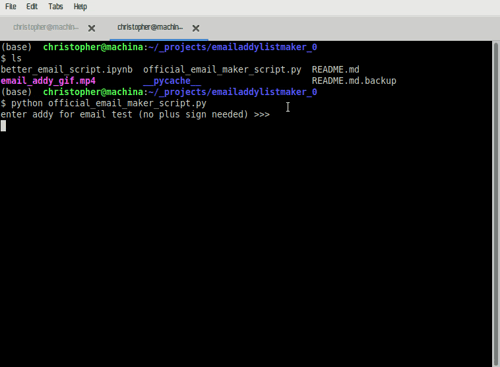

# Email Factory

This is an email csv generator I created while working for a previous client.

I built this because the alternative was entering the emails 1 by 1, going through a mile-long page with umpteen forms to fill in (or not fill in.

This process was extremely error prone and to prepare for a large scale test, we would have to enter dozens of emails, sometimes multiple times for test failures.

The site (Maropost) had a way to upload emails as csv files. I would come up with a testing alias, example below... 

youremailhandle+hereisthealias@mailtime.com

...and after entering how many emails we needed, the script would generate three separate csvs for all three people in my department and then we could easily upload the emails to Maropost.This is an email creation script I use for work.

All of the hard coded information is changed to protect the identities of my
past team members but it all works the same.

If it works for you, steal it.
Have any questions, feel free to ask.
